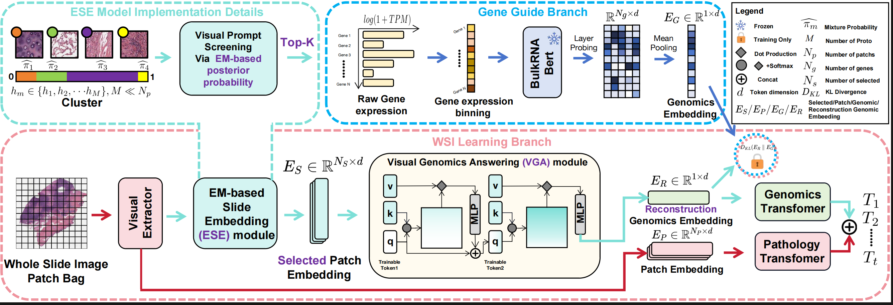

# VGAT: A Cancer Survival Analysis Framework Transitioning from Generative Visual Question Answering to Genomics Reconstruction (ICME2025)
The PyTorch implementation of Vision Genomic Answering-Guided Transformer (VGAT) as described in the paper "VGAT: A Cancer Survival Analysis Framework Transitioning from Generative Visual Question Answering to Genomics Reconstruction."



## Installation Guide for Linux (using anaconda)
### Pre-requisities: 
- Linux (Tested on Ubuntu 22.04)
- NVIDIA GPU A6000*4 with CUDA 11.8 and cuDNN 8.6
- Python (3.10.14), numpy (1.25.0), pandas (2.2.2), torch (2.3.1), scikit-learn (1.5.0), scipy (1.13.1),
- （Used for obtaining BulkRNA embedding） jax(0.4.19), jaxlib(0.4.19+cudnn86), joblib(1.3.2), dm-haiku(0.0.10), pydantic(1.10.5)

## Prepare your data
### WSIs
1. Download diagnostic WSIs from [TCGA](https://portal.gdc.cancer.gov/)
2. Use the WSI processing tool provided by [CLAM](https://github.com/mahmoodlab/CLAM) to extract resnet-50 pretrained 1024-dim feature for each 256 $\times$ 256 patch (20x), which we then save as `.pt` files for each WSI. So, we get one `pt_files` folder storing `.pt` files for all WSIs of one study.

### Genomics embeeding
1. Download RNA-seq data matching with WSIs from [TCGA](https://portal.gdc.cancer.gov/)
2. Use the [BulkRNABert](https://github.com/instadeepai/multiomics-open-research)  to preprocessing and get geneomics embedding,which we then save as `.pt` files for each patient.If a patient has multiple gene sequencing records, only one is retained.

The final structure of datasets should be as following:
```bash
DATA_ROOT_DIR/
    └──dataset1/    
        └──feats_pt/
          ├── slide_id_1.pt
          ├── slide_id_2.pt
          └── ...
        └──gene_pt/
          ├── case_id_1.pt
          ├── case_id_2.pt
          └── ...
    └──dataset2/    
        └──feats_pt/
          └── ...
        └──gene_pt/
          └── ...
    └──.... 
```
DATA_ROOT_DIR is the base directory of your all datasets (BLCA,BRCA,GBMLGG,LUAD,UCEC)

### Training-Validation Splits
Splits for each cancer type are found in the `splits/5foldcv ` folder, which are randomly partitioned each dataset using 5-fold cross-validation. Each one contains splits_{k}.csv for k = 0 to 4. 

### Cluster centroid vector
As the EM algorithm relies on cluster centroids derived from K-means for further computations, to prevent validation set leakage, we have prepared cluster centroid vectors for each of the five-fold cross-validation training sets. If you are using the same split as us, no additional work is required. If you wish to change the splits, you can refer to [PANTHER](https://github.com/mahmoodlab/PANTHER) to obtain the cluster centroid vectors.

## Running Experiments

use the following generic command-line and specify the arguments:
```bash
CUDA_VISIBLE_DEVICES=<DEVICE_ID> python main.py \
--data_root_dir <DATA_ROOT_DIR> \
--dataset <SPLITS_FOR_CANCER_TYPE> \
--modal bert_coattn \
--model vgat \
--select em \
--loss nll_surv_kl 
```


